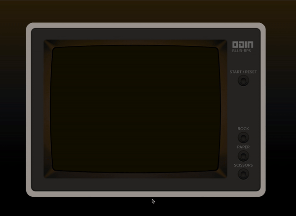

# Rock Paper Scissors #

Game developed for the Odin Project curriculum
[Live Demo](https://blu3tan.github.io/rock_paper_scissors/)

# Concept #

Ok i've probably spent to much time on polishing this, but i had an idea and
i wanted to achieve the exact look i had in mind.
I've learned a lot in the process and i am quite proud of the final result.

One of my first goal for the graphical side was to provide with the game an
original user experience but at the same time keeping it simple.
I have used a custom svg with an attached image and the buttons mapped on top
as vector shapes so the project is fully responsive, although the ux and visibility
on mobile is far from optimal but i decided not to fall deeper into the rabbit hole.

# Credits #

-   The computer is an Amdek 310-A (modified) inspired by [LGR](https://www.youtube.com/watch?v=XphXo2BSjL4)

-   The retro sound effects are from [Pixabay](https://pixabay.com/)

-   The ascii emoji are from [Dysfunc](https://github.com/dysfunc/ascii-emoji)

I have hidden (not quite) the credits inside the design as an easter egg.
I also left at the bottom of this readme the old notes written on the first
stage of this project.

Enjoy.

------------------------------------------------------------------------